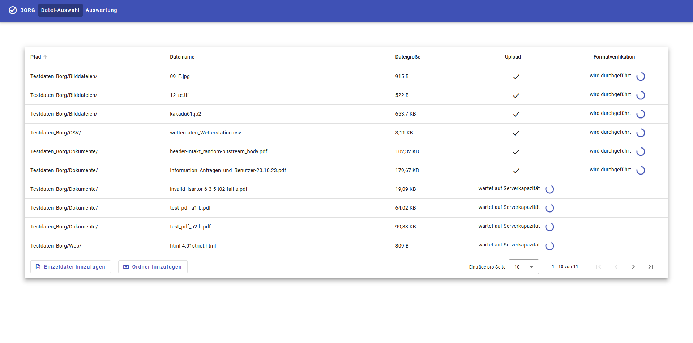
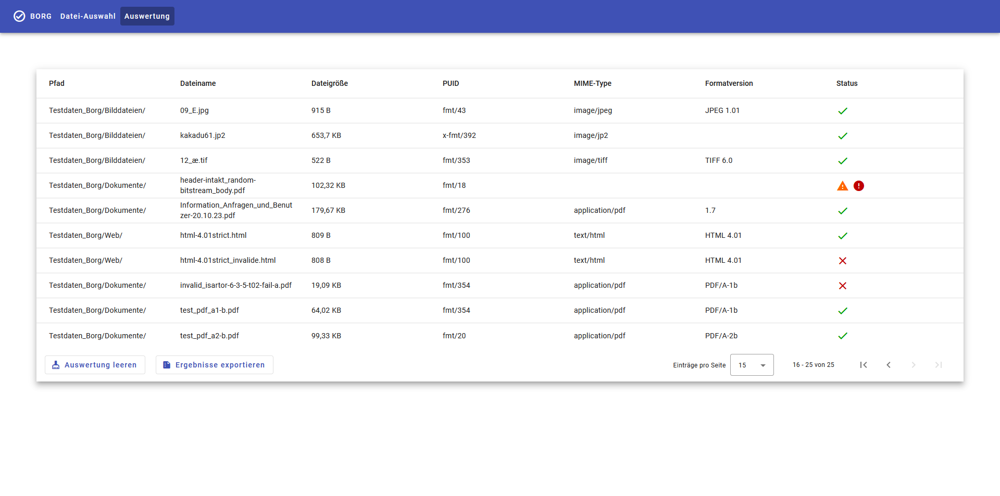
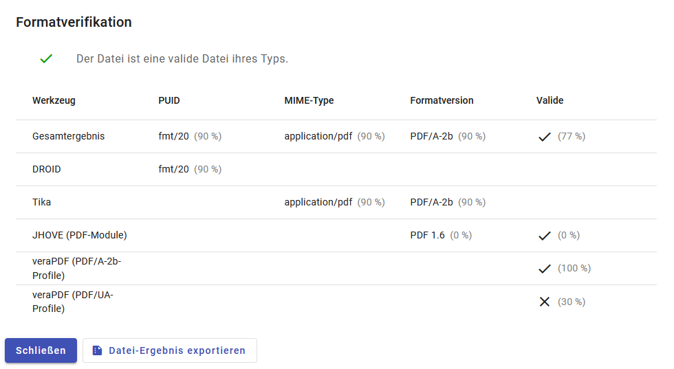
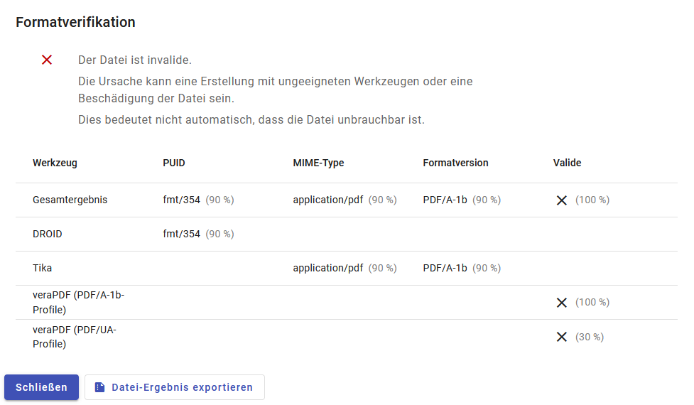
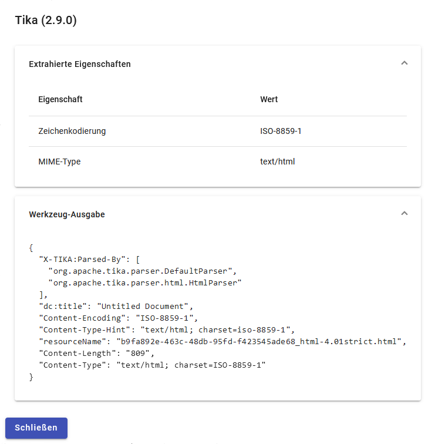

# BorgFormat

BorgFormat (kurz Borg) ist ein Programm für die Formaterkennung und -validierung. Die Anwendung integriert verschiedene Werkzeuge um eine möglichst umfassende Abdeckung bei der Identifizierung und Validierung von Dateiformaten zu erreichen.

## Integrierte Werkzeuge

| Name            | Funktion        | Resourcen                                                        | Lizenz                                                                                                        |
| --------------- | --------------- | ---------------------------------------------------------------- | ------------------------------------------------------------------------------------------------------------- |
| Droid           | Formaterkennung | [Homepage ](https://digital-preservation.github.io/droid/)       | [BSD License](https://github.com/digital-preservation/droid/blob/master/license.md)                           |
| Tika            | Formaterkennung | [Homepage](https://tika.apache.org/)                             | [Apache License, Version 2.0](https://www.apache.org/licenses/LICENSE-2.0)                                    |
| JHOVE           | Validierung     | [Homepage](https://jhove.openpreservation.org)                   | [GNU Lesser General Public License](https://www.gnu.org/licenses/lgpl-3.0.html)                               |
| verapdf         | Validierung     | [Homepage](https://verapdf.org/)                                 | [GNU General Public License v3.0](https://github.com/veraPDF/veraPDF-validation/blob/integration/LICENSE.GPL) |
| ODF Validator   | Validierung     | [Homepage](https://odftoolkit.org/conformance/ODFValidator.html) | [Apache License, Version 2.0](https://github.com/tdf/odftoolkit/blob/master/validator/LICENSE.txt)            |
| OOXML Validator | Validierung     | [GitHub](https://github.com/mikeebowen/OOXML-Validator)          | [MIT License](https://github.com/mikeebowen/OOXML-Validator/blob/main/LICENSE)                                |

## Roadmap

Die Weiterentwicklung von Borg wird sich hauptsächlich um die Integration neuer Werkzeuge und die Extraktion von weitereren Metadaten aus den Werkzeugergebnissen drehen. Folgende Weiterentwicklungen sind für die nächsten Veröffentlichungen vorgesehen:

- Integration des Werkzeugs [Google Magika](https://github.com/google/magika) für die Formaterkennung, besonders für textbasierte Formate
- Integration des Werkzeugs [jpylyzer](https://github.com/openpreserve/jpylyzer) für die Validierung von JP2-Dateien (JPEG 2000 Part 1)
- PDF-Export von Gesamt- und Teilergebnissen

## Motivation

Die Formaterkennung und -validierung von unbekannten Dateien ist ein komplexes Problem. Aufgrund der Komplexität kann kein einzelnes Programm das Problemfeld vollständig lösen. In der Regel sind Anwendungen darauf spezialisiert, entweder Dateien mit unbekannten Formaten zu identifizieren oder eine Formatfamilie bzw. eine kleine Gruppe von Dateiformaten zu validieren.  
Um eine möglichst umfassende Abdeckung bei der Identifizierung und Validierung von Dateiformaten zu erreichen, ist es daher notwendig, mehrere Programme miteinander zu kombinieren. Es gibt bereits vereinzelt Programme, die mehrere Werkzeuge für die Formaterkennung und -validierung einbinden. Diese eingebundenen Werkzeuge werden in der Regel direkt integriert oder lokal ausgeführt.  
Für Borg wurde ein anderer Ansatz gewählt. Die Werkzeuge werden nicht direkt integriert, sondern werden in eigenen Containern ausgeführt und über eine Web-API angesprochen. Das verringert die Abhängigkeit von Systemvorraussetzungen der verwendeten Werkzeuge.

## Funktionsweise

**Wie kommunizieren der Client, der Borg-Server und die Werkzeuge?**

Der Server und die Werkzeuge werden in jeweils einem eigenen Container mittels Docker gestartet. Der Client und der Server kommunizieren über eine Web-API. Das Gleiche gilt für die Kommunikation zwischen dem Server und den Werkzeugen. Der Client kommuniziert nie direkt mit den Werkzeugen. Stattdessen sendet er eine Datei an den Server und erhält eine Zusammenfassung aller Werkzeugergebnisse und ein berechnetes Gesamtergebnis zurück.

**Was passiert mit der übermittelten Datei?**

Nachdem der Server die Datei vom Client erhält, speichert er diese in ein Docker Volume. Auf dieses haben auch alle Werkzeuge Zugriff. Sobald alle notwendigen Werkzeuge die Datei analysiert haben, wird sie gelöscht.

**Welche Werkzeuge werden für eine Datei angesprochen?**

Als erstes werden alle Formaterkennungs-Werkzeuge ausgeführt. Anhand der Erkennungsergebnisse werden die konfigurierten Bedingungen für die Ausführung der Validatoren geprüft. Alle Validatoren für die mindestens eine Bedingung erfüllt ist, werden ausgeführt.

**Wir wird das Gesamtergebnis ermittelt?**

Für die Ermittlung eines Gesamtergebnisses müssen die einzelnen Werkzeugergebnisse vergleichbar sein. Zu diesem Zweck werden einzelne Eigenschaften aus den Werkzeugergebnissen extrahiert. Den extrahierten Eigenschaften wird über die Konfiguration eine Gewichtung von 0 bis 1 zugewiesen. Wenn mehrere Werkzeuge die gleiche Eigenschaft extrahieren, findet eine gewichtete Abstimmung zwischen den Werkzeugeergebnissen statt. Durch die Gewichtung können zuverlässigere Werkzeuge weniger verlässliche Werkzeuge überstimmen. Alle von den Tools extrahierten Werte erhalten durch die Abstimmung eine Gewichtung für das Gesamtergebnis zwischen 0 und 1. Der extrahierte Wert mit der höchsten Gewichtung wird Teil des Gesamtergebnisses.

**Gibt es eine Möglichkeit die Gewichtung einzelner extrahierter Eigeschaften zu verfeinern?**

Neben dem Standardwert, der pro Werkzeug und extrahierter Eigenschaft festgelegt wird, gibt es auch die Möglichkeit Werte unter bestimmten Bedingungen auf- oder abzuwerten. Die Bedingungen beziehen sich immer auf das Gesamtergebnis. Beispielsweise ist es möglich die Ergebnisse eines Werkzeugs abzuwerten, wenn ein bestimmter MIME-Type ermittelt wurde.

## Integration in andere Programme

Borg ist dafür gedacht in für die andere Programme integriert zu werden. Der Borg-Server bietet dafür eine Web-API, die von beliebigen Programmen genutzt werden kann, um Dateien auswerten zu lassen.

## Standalone Webanwendung

Borg stellt eine Webanwendung bereit, mit der beliebige Dateien analysiert werden können.

**Datei-Auswahl**

Der Reiter Dateiauswahl ermöglicht die Auswahl von einzelnen Dateien und ganzen Ordnern für die Analyse. Wenn ein Ordner ausgewählt wird, werden auch die Dateien aller enthaltenen Ordner hochgeladen.



**Auswertung**

Im Reiter Auswertung wird das Gesamtergebnis für alle hochgeladenen Dateien dargestellt. Für jede Datei werden in einer eigenen Zeile die wichtigsten extrahierten Eigenschaften sowie der Status angezeigt. Der Status stellt die Qualität des Gesamtergebnisses symbolisch dar. Detaillierte Ergebnisse der Werkzeuge können durch einen Klick auf die Zeile aufgerufen werden.



**Detailansicht von Werkzeugergebnissen für einzelne Dateien**

In der Detailansicht einer Datei wird die Zusammenstellung des Gesamtergebnisses aufgeschlüsselt. Es wird dargestellt, welche Werkzeuge mit welcher Gewichtung in das Gesamtergebnis eingegangen sind und wie der (angezeigte) Status zu interpretieren ist. Die Detailansicht eines Werkzeuges lässt sich durch einen Klick auf die entsprechende Zeile öffnen.

**Detailansicht einer validen Datei**



**Detailansicht einer invaliden Datei**



**Detailansicht eines Werkzeugs**

In der Detailansicht eines Werkzeugs werden alle extrahierten Eigenschaften und die vollständige Werkzeugausgabe angezeigt.



## Installation

Für den Betrieb von Borg wird [Docker](https://docs.docker.com/) inklusive [Docker Compose](https://docs.docker.com/compose/) benötigt. Für den regulären Betrieb empfehlen wir die Installation auf einem Linux-Server. Für einen lokalen Test der Standalone-Version von Borg ist auch der Einsatz von [Docker Desktop](https://docs.docker.com/desktop/) möglich. In der Datei [.env](.env) kann ein Proxy für den Zugriff auf das Internet und der Port unter dem die Anwendung angesprochen werden kann, festgelegt werden. Borg benötigt nur bei der Erstellung der Container eine Internetverbindung. Im Betrieb wird keine Internetverbindung benötigt. Um die Anwendung in einem Netzwerk verfügbar zu machen, eignet sich ein Webserver als Reverse-Proxy wie bspw. [NGINX](https://www.nginx.com/), der die Anfragen auf den konfigurierten Port der Anwendung weiterleitet. Für die Konfiguration des Webservers ist zu beachten, dass die Grenzen für die Dateigröße beim Upload und Timeouts von Verbindungen ausreichend bemessen werden, das auch größere Dateien analysiert werden können.

Um alle für den Betrieb von Borg benötigten Container zu starten, genügt der folgende Befehl:

```sh
docker compose up --build -d
```

## Konfiguration

Das Verhalten des Borg-Servers wird mittels eine [Konfigurationsdatei](server/config/server_config.yml) eingestellt. Die Datei bestimmt, wie die Werkzeuge angesprochen werden, unter welchen Bedingungen Validatoren ausgeführt werden und wie einzelne extrahierte Eigenschaften gewichtet werden.

### Voreinstellungen

Borg wird mit einer bereits funktionalen Konfiguration ausgeliefert. Diese stellt sich vereinfacht wie folgt dar:

#### Bedingungen für die Ausführung

| Werkzeug                  | Bedingung                                                                                                   |
| ------------------------- | ----------------------------------------------------------------------------------------------------------- |
| DROID                     | wird immer ausgeführt                                                                                       |
| Tika                      | wird immer ausgeführt                                                                                       |
| JHOVE (PDF-Modul)         | PUID entspricht PDF Version 1.0 bis 1.7 oder MIME-Type enthält /pdf                                         |
| JHOVE (HTML-Modul)        | PUID entspricht HTML Version 3.2, 4.0 oder 4.01 (HTML 5 wird nicht unterstützt) oder MIME-Type enthält html |
| JHOVE (TIFF-Modul)        | PUID entspricht TIFF oder MIME-Type enthält tiff                                                            |
| JHOVE (JPEG-Modul)        | PUID entspricht JPEG oder MIME-Type enthält jpeg                                                            |
| JHOVE (JPEG2000-Modul)    | PUID entspricht JP2 (JPEG 2000 part 1) oder MIME-Type enthält jp2                                           |
| veraPDF (PDF/A-1a-Profil) | PUID entspricht PDF/A-1a oder Formatversion entspricht PDF/A-1a                                             |
| veraPDF (PDF/A-1b-Profil) | PUID entspricht PDF/A-1b oder Formatversion entspricht PDF/A-1b                                             |
| veraPDF (PDF/A-2a-Profil) | PUID entspricht PDF/A-2a oder Formatversion entspricht PDF/A-2a                                             |
| veraPDF (PDF/A-2b-Profil) | PUID entspricht PDF/A-2b oder Formatversion entspricht PDF/A-2b                                             |
| veraPDF (PDF/A-2u-Profil) | PUID entspricht PDF/A-2u oder Formatversion entspricht PDF/A-2u                                             |
| veraPDF (PDF/UA-Profile)  | MIME-Type enthält pdf, nach aktuellen Stand keine PUID verfügbar                                            |
| ODF Validator             | MIME-Type beginnt mit application/vnd.oasis.opendocument.                                                   |
| OOXML Validator           | MIME-Type beginnt mit application/vnd.openxmlformats-officedocument.                                        |

#### Gewichtung der extrahierten Eigenschaften

| Werkzeug                 | PUID | MIME-Type | Formatversion         | Validierung            |
| ------------------------ | ---- | --------- | --------------------- | ---------------------- |
| DROID                    | 90%  | 90%       | 90%                   |                        |
| Tika                     |      | 90%       | 90%                   |                        |
| JHOVE                    |      |           | 80%                   | 100%                   |
| JHOVE (PDF-Modul)        |      |           | 80% bzw. 0% bei PDF/A | 100% bzw. 0% bei PDF/A |
| veraPDF                  |      |           |                       | 100%                   |
| veraPDF (PDF/UA-Profile) |      |           |                       | 30%                    |
| ODF Validator            |      |           |                       | 100%                   |
| OOXML Validator          |      |           |                       | 100%                   |
