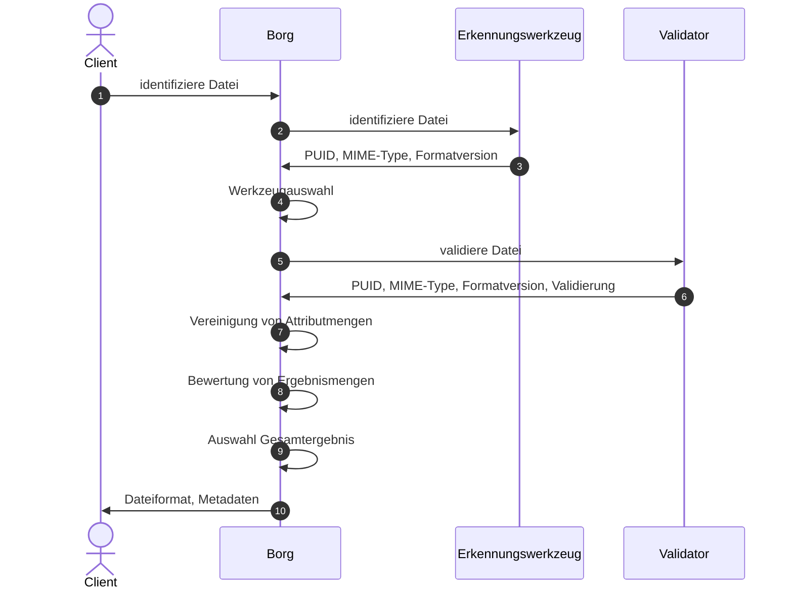
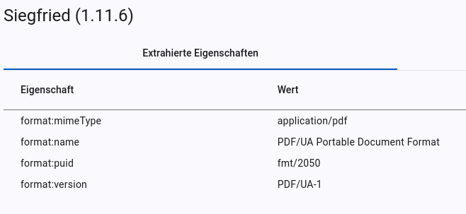
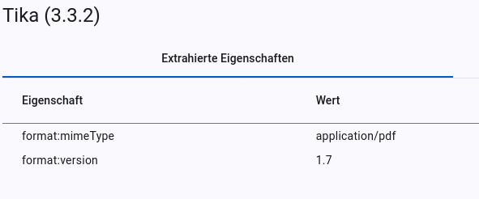
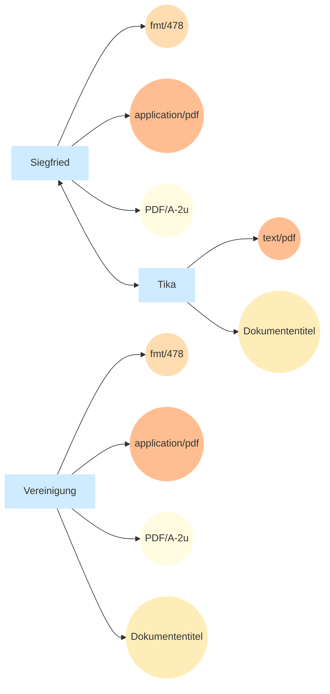
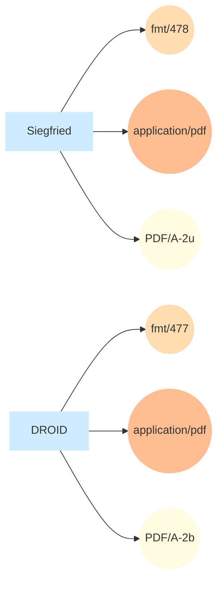
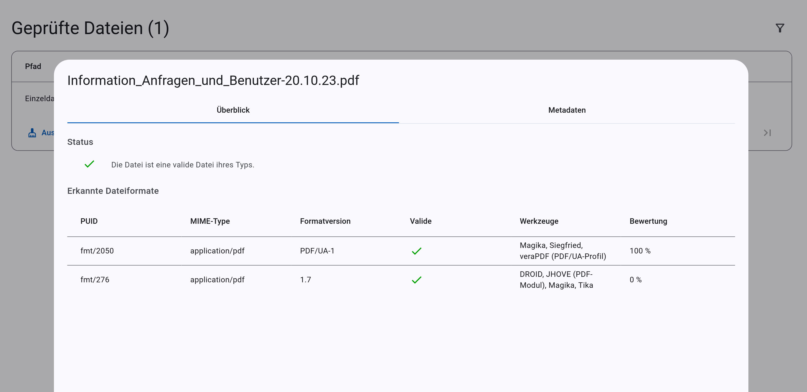

# Konzept

Dieses Konzept soll die theoretischen Grundlagen für die Funktionsweise von Borg beschreiben. Es dient dazu, die zentralen Zusammenhänge, Prinzipien und Annahmen der Anwendung nachvollziehbar darzustellen.

## 1. Begriffsklärung

| Begriff        | Erklärung                                                                |
| -------------- | ------------------------------------------------------------------------ |
| Attribut       | aus einem Werkzeugerbnis extrahierte Eigenschaft bspw. PUID              |
| Attributmenge  | alle aus einem Werkzeugerbnis extrahierten Eigenschaften                 |
| Ergebnismenge  | kumulierte Attributmengen, die ein Dateiergebnis repräsentieren          |
| Gesamtergebnis | Ergebnismenge mit der höchsten Bewertung                                 |
| Werkzeug       | Programm für die Formaterkennung, -validierung oder Metadatenextraktion  |

## 2. Ablauf der Formatverifikation

Die Formatverifikation mit Borg erfolgt nach dem folgenden Ablauf:

1. Ein Client übermittelt eine Datei zur Formatverifikation an Borg.
2. Borg führt alle generischen Werkzeuge (s. [Kap. 3](#3-werkzeugauswahl)) aus und übermittelt ihnen die Datei zur Analyse.
3. Die Werkzeuge analysieren die Datei, extrahieren Metadaten (s. [Kap. 5](#5-extraktion-von-attributen)) und übermitteln ihre Ergebnisse an Borg.
4. Auf Grundlage der Erkennungsergebnisse wählt Borg weitere Werkzeuge aus (s. [Kap. 3](#3-werkzeugauswahl)).
5. Borg führt die ausgewählten spezialisierten Werkzeuge aus.
6. Die Werkzeuge analysieren die Datei, extrahieren Metadaten (s. [Kap. 5](#5-extraktion-von-attributen)) und übermitteln ihre Ergebnisse an Borg.
7. Borg führt die Ergebnisse der aller Werkzeuge zusammen (s. [Kap. 7](#7-vereinigung-von-attributmengen)).
8. Borg bewertet die zusammengeführten Ergebnisse (s. [Kap. 8](#8-bewertung-von-ergebnismengen)).
9. Das am besten bewertete Ergebnis wird als Gesamtergebnis festgelegt.
10. Borg übermittelt das Gesamtergebnis, die extrahierten Metadaten, sowie die Originalausgaben Ausgaben der Werkzeuge an den Client.


<center><figcaption>Abb. 1: Ablauf der Formatverifikation mit Borg</figcaption></center>

## 3. Werkzeugauswahl

Für jede Datei sollen alle Werkzeuge ausgeführt werden, die Informationen zu der Datei ermitteln können. Dabei wird zwischen generischen und spezialisierten Werkzeugen unterschieden. Bei generischen Werkzeugen spielt das Dateiformat keine Rolle (bspw. Formaterkennungswerkzeuge), während spezialisierte Werkzeuge nur für eine Auswahl von Dateiformaten Informationen ermitteln können. Zu den spezialisierten Werkzeugen zählen beispielsweise Validatoren.

Die generischen Werkzeuge werden für alle Dateien ausgeführt. Für Validatoren und andere spezialisierte Werkzeuge, beispielsweise MediaInfo, werden hingegen Bedingungen für die Ausführung festgelegt (s. Abb. 2). Die Werkzeugausführung erfolgt daher grundsätzlich in zwei Phasen: Zunächst werden die generischen Werkzeuge ausgeführt. Anschließend wird anhand ihrer Ergebnisse ermittelt, welche spezialisierten Werkzeuge ausgeführt werden. Die Ausführungsbedingung eines spezialisierten Werkzeugs gilt als erfüllt, sobald ein generisches Werkzeug die hierfür erforderlichen Ergebnisse ermittelt hat.

```yaml
id: "verapdf_1b"
enabled: true
title: "veraPDF (PDF/A-1b-Profil)"
endpoint: "http://verapdf/validate/1b"
triggers:
  - conditions:
      - feature: "format:version"
        regEx: "PDF/A-1b"
  - conditions:
      - feature: "format:puid"
        regEx: "^fmt/354$" # PDF/A-1b
```
<center><figcaption>Abb. 2: Bedingungen für die Ausführung von Siegfried</figcaption></center>

## 4. Werkzeugausgaben

Die Werkzeugausgaben sind sehr heterogen (s. Vergleich Abb. 3 und 4). Eine simple Zusammenführung ist initial ohne weitere Verarbeitungsschritte nicht möglich.

```json
{
  "filename": "e077dbcb-2b5c-41c8-810b-8a69d5c47fbf_Information_Anfragen_und_Benutzer-20.10.23.pdf",
  "filesize": 179666,
  "modified": "2026-09-09T06:55:13Z",
  "errors": "",
  "matches": [
    {
      "ns": "pronom",
      "id": "fmt/2050",
      "format": "PDF/UA Portable Document Format",
      "version": "1",
      "mime": "application/pdf",
      "class": "Page Description",
      "basis": "extension match pdf; byte match at [[0 8] [170470 30]]",
      "warning": ""
    }
  ]
}
```
<center><figcaption>Abb. 3: Werkzeugausgabe von Siegfried</figcaption></center>

```json
{
  "pdf:PDFVersion": "1.7",
  "xmp:CreatorTool": "Microsoft® Word 2019",
  "pdf:docinfo:title": "Informationen zum Umgang mit personenbezogenen Daten gemäß Artikel 12 Datenschutz-Grundverordnung",
  "pdf:hasXFA": "false",
  "dc:format": "application/pdf; version=1.7",
  "pdf:docinfo:creator_tool": "Microsoft® Word 2019",
  "access_permission:fill_in_form": "true",
  "pdf:hasCollection": "false",
  "pdf:encrypted": "false",
  "dc:title": "Informationen zum Umgang mit personenbezogenen Daten gemäß Artikel 12 Datenschutz-Grundverordnung",
  ...
}
```
<center><figcaption>Abb. 4: Werkzeugausgabe von Tika</figcaption></center>

## 5. Extraktion von Attributen

Um eine Vergleichbarkeit der Ergebnisse zu ermöglichen, müssen geeignete Attribute aus dem Gesamtergebnis extrahiert werden (s. Abb. 5 und 6). Attribute eignen sich besonders für die Verknüpfung von Werkzeugausgaben, wenn die Werte sich über mehrere Werkzeuge gleichen. Ein Beispiel für ein sehr gut geeignetes Attribut ist die *PUID*. Diese sollte über alle Werkzeugergebnisse, wenn das gleiche Format erkannt wurde, identisch sein. Der *MIME-Type* ist relativ gut geeignet. Die Werkzeuge liefern häufig zumindest ähnliche Werte für den *MIME-Type*. Auch wenn gelegentlich kleinere Abweichungen auftreten, sollte zumindest der Subtyp übereinstimmen. Beispielsweise sind für PDF-Dateien sowohl *text/pdf*, als auch *application/pdf* mögliche Werte. Der Formatname ist für den Vergleich von Werkzeugausgaben überhaupt nicht geeignet. Dieser unterscheidet sich in allen Werkzeugen.

<figure markdown="span">
  { loading=lazy }
  <center><figcaption>Abb. 5: Extrahierte Eigenschaften von Siegfried</figcaption></center>
</figure>

<figure markdown="span">
  { loading=lazy }
  <center><figcaption>Abb. 6: Extrahierte Eigenschaften von Tika</figcaption></center>
</figure>

## 6. Vereinigung auf Attributebene

Um ein Gesamtergebnis zu ermitteln, müssen die von den verschiedenen Werkzeugen extrahierten Attributwerte sinnvoll zusammengeführt werden. Im einfachsten Fall liefern alle Werkzeuge für dasselbe Attribut denselben Wert. Die zentrale Frage ist jedoch, wie mit unterschiedlichen Werten umgegangen werden soll.

Eine Methode besteht darin, einen Wert auszuwählen und dabei bestimmte Werkzeuge für einzelne Attribute zu bevorzugen. So könnte beispielsweise grundsätzlich der von DROID ermittelte MIME-Type übernommen werden. Liefert DROID keinen Wert, könnte stattdessen das Ergebnis von JHOVE herangezogen werden. Der Nachteil dieser Methode besteht darin, dass stets das priorisierte Werkzeug ausschlaggebend ist, selbst dann, wenn mehrere andere Werkzeuge denselben abweichenden Wert ermittelt haben.

Um diesem Problem entgegenzuwirken, können die Werkzeuge über die von ihnen ermittelten Werte abstimmen. Dadurch kann die Mehrheit die Entscheidung eines einzelnen Werkzeugs überstimmen. Zusätzlich können die Werkzeuge unterschiedlich gewichtet werden, sodass sie nicht alle gleichermaßen in das Gesamtergebnis eingehen. Diese Methode hat jedoch die Schwäche, dass theoretisch nicht zusammengehörige Attributwerte in das Gesamtergebnis einfließen können. So könnte beispielsweise eine PUID ermittelt werden, die nicht zum festgestellten MIME-Type passt.

Diesem Problem kann begegnet werden, indem alle von den Werkzeugen extrahierten Eigenschaften als untrennbare Einheit betrachtet werden.

## 7. Vereinigung von Attributmengen

Statt zu versuchen Werkzeugergebnisse auf Attributebene zusammenzuführen, werden die Attributmengen (Menge aller extrahierten Attribute von einem Werkzeug) der Werkzeuge zusammengeführt, wenn davon auszugehen ist, dass die Werkzeuge das gleiche Dateiformat ermittelt haben. Dafür werden für jedes Werkzeug Bedingungen festgelegt, wann die eigene Attributmenge mit einer anderen zusammengeführt werden kann. Wenn eine Bedingung nicht erfüllt wird, können die Attributmengen nicht vereinigt werden. Die Bedingungen werden beidseitig geprüft. Das bedeutet, dass beide Attributmengen die Bedingung der anderen erfüllen müssen. Besitzt eine Attributmenge das Attribut für eine Bedingung nicht, so gilt die Bedingung als erfüllt. Beispielsweise werden für Siegfried 3 Bedingungen konfiguriert (s. Abb. 7), damit die Attributmenge mit einer anderen vereinigt werden kann.

```yaml
  - id: "siegfried"
    enabled: true
    title: "Siegfried"
    endpoint: "http://siegfried/identify"
    featureSet:
      features:
        - key: "format:puid"
          mergeCondition:
            exactMatch: true
        - key: "format:mimeType"
          mergeCondition:
            valueRegEx: "^[^/]+/(.+)$" # extracts the second part of the MIME type
        - key: "format:version"
          mergeCondition:
            exactMatch: true
        - key: "format:name"
          mergeOrder: 1
      weight:
        default: 0.75
```
<center><figcaption>Abb. 7: Standardkonfiguration von Siegfried</figcaption></center>

**Bedingungen für die Vereinigung mit Siegfried**

1. PUID muss exakt identisch sein
2. Subtype des MIME-Types muss identisch sein (application/pdf --> pdf)
3. Formatversion muss exakt identisch sein

**1. Beispiel Vereinigung ist möglich**



**2. Beispiel Vereinigung ist NICHT möglich**



Die Attributmengen aller Werkzeuge werden nacheinander miteinander vereinigt. Die hinzugefügte Attributmenge überschreibt dabei alle Werte der bisherigen Vereinigung. Es können Ausnahmen festgelegt werden, wenn der originale Wert bei er Vereinigung bestehen bleiben soll. In der Standardkonfiguration von DROID und Siegfried wird bspw. festgelegt, dass der Formatname von diesen Werkzeugen bei der Vereinigung erhalten bleiben soll, weil die Qualität des Attributs bei diesen Werkzeugen besser ist.

Formatvalidatoren extrahieren oft keine eigenen Formatattribute. Um die Attributmengen der Validatoren mit denen der Erkennungswerkzeuge vereinigen zu können, werden die Attributmengen der Validatoren angereichert. Diesen Mengen werden Formateigenschaften für das validierte Dateiformat hinzugefügt.

Am Ende entstehen eine oder mehrere Ergebnismengen. Mehrere Ergebnismengen entstehen, wenn nicht alle Attributmengen miteinander vereinigt werden können. In dem Fall ist davon auszugehen, dass die Werkzeuge unterschiedliche Formate erkannt haben (s. Abb. 8).

<figure markdown="span">
  { loading=lazy }
  <center><figcaption>Abb. 8: Mehrere erkannte Dateiformate für eine Datei</figcaption></center>
</figure>

## 8. Bewertung von Ergebnismengen

Um ein Gesamtergebnis auswählen zu können, wenn es mehrere Ergebnismengen bzw. erkannte Dateiformate gibt, wird für jede Ergebnismenge eine Bewertung berechnet. Qualitativere Ergebnisse sollen entsprechend besser bewertet werden. Jedes Werkzeug stimmt dafür mit einer festgelegten Gewichtung für alle Ergebnismengen mit denen die eigenen Attributmengen vereinigt wurde. **Die Ergebnismenge mit der höchsten Bewertung wird zum Gesamtergebnis.** Für jedes Werkzeug kann eine Standardgewichtung und beliebig viele bedingte Gewichtungen definiert werden.

### Bedingte Gewichtung

Für Validatoren wird eine Standardgewichtung von 0.0 und eine bedingte Gewichtung von 1.0, falls das Ergebnis valide ist, definiert (s. Abb. 9). Ein negative Validierung, hat wenig Aussagekraft über die geprüfte Datei, eine positive ist hingegen eine Garantie, dass das Dateiformat korrekt erkannt wurde.

```yaml
  - id: "verapdf_1a"
      weight:
        default: 0.0
        conditional:
          - value: 1.0
            conditions:
              - feature: "format:valid"
                value: true
```
<center><figcaption>Abb. 9: Standardkonfiguration veraPDF: PDF/A-1a</figcaption></center>

### Bindungsstärke

Bei der Vereinigung von Attributmengen, werden die Gewichtungen addiert. Es ist aber nicht sinnvoll, dass die Attributmenge, die hinzukommt, immer mit der vollen Gewichtung integriert wird. Attributmengen, die die Bedingungen für eine Vereinigung nicht erfüllen können, weil die geforderten Attribute nicht enthalten sind, werden trotzdem vereinigt. Es würde das Ergebnis aber verfälschen, wenn sich dadurch die Bewertung der vereinigten Attributmenge verbessert. Manche Werkzeuge extrahieren nur wenig Format-spezifische Attribute. Magika kann beispielsweise nur den MIME-Type erkennen. Auch hier wäre es verfälschend, wenn die Magika-Gewichtung vollständig, in die Bewertung der Attributmenge eingeht, nur weil der MIME-Type identisch ist. Im Vergleich ist die Attributmenge eines Validators viel aussagekräftiger für die Bewertung, wenn bspw. PUID, MIME-Type, Formatversion und Validierung enthalten sind.

Das Konzept der Bindungsstärke soll diesem Problem entgegenwirken. Die zugrunde liegende Idee besteht darin, dass ähnliche Ergebnismengen viele gemeinsame Attribute aufweisen. Im Anwendungskontext wird dies durch die bei der Vereinigung erfüllten Bedingungen ausgedrückt. Jede erfüllte Bedingung erhöht die Bindungsstärke zwischen den Attributmengen. Mit zunehmender Bindungsstärke steigt der Einfluss der integrierten Attributmenge auf die Bewertung.

### Berechnung der Bewertung

| Symbol                               | Bedeutung                                                                |
| ------------------------------------ | ------------------------------------------------------------------------ |
| \(A_i\)                              | einzelne Attributmenge                                                   |
| \(E_i\)                              | einzelne Ergebnismenge                                                   |
| \(G_{\text{w}}\)                     | Gewichtung des Werkzeugs einer Attributmenge                             |
|\(n_i\)                               | Anzahl der erfüllten Bedingungen für die Vereinigung der Attributsmengen |
| \(\mathcal{A}_{\text{vereinigt}}\)   | Menge der für das Ergebnis vereinigten Attributmengen                    |
| \(G(A_{\text{i}})\)                  | Gewichtung einer Attributmenge                                           |
| \(B(E_{\text{i}})\)                  | Bewertung einer Ergebnismenge                                            |
| \(B_{\text{norm}}\)    | normalisierte Bewertung einer Ergebnismenge im Intervall von 0 bis 1     |

#### 1. Berechnung der Gewichtung einer Attributsmenge

$$
G(A_i) = \min\left(0{,}25 \cdot n_i,\; 1\right) \cdot G_{\text{W}}
$$

#### 2. Berechnung der Bewertung einer Ergebnismenge

$$
B(E_j) = \sum_{A_i \in \mathcal{A}_{\mathrm{vereinigt}}}G(A_i)
$$

#### 3. Berechnung der normalisierten Bewertung einer Ergebnismenge

$$
B_{\text{norm}}=\frac{B(E_{\text{j}})}{\sum_{E_j \in \mathcal{E}} B(E_j)}
$$

### Überschreiben der Bewertung

Es gibt Fälle, in denen die berechnete Bewertung nicht den Erwartungen entspricht. Es ist nicht ungewöhnlich, dass eine Datei gleichzeitig die Anforderungen mehrerer Dateiformate erfüllt. Eine valide PDF/UA-Datei (ISO 32000-1) ist beispielsweise immer auch eine valide PDF-1.7-Datei. Borg erkennt in diesem Fall beide Dateiformate (s. Abb. 9).

<figure markdown="span">
  { loading=lazy }
  <center><figcaption>Abb. 9: Erkannte Dateiformate für eine PDF/UA-Datei</figcaption></center>
</figure>

Die meisten Werkzeuge erkennen PDF-1.7, nicht jedoch PDF/UA, als Dateiformat. Daher fällt die Bewertung der Ergebnismenge für PDF-1.7 höher aus als diejenige für PDF/UA. Um solche Sonderfälle zu behandeln, können Bedingungen zum Überschreiben der Bewertung definiert werden. Sind die Bedingungen für eine Ergebnismenge erfüllt, wird deren Bewertung auf 1,0 angehoben. Die Bewertungen der übrigen Ergebnismengen werden entsprechend auf 0,0 gesetzt. Um PDF/UA aufzuwerten wird zwei Bedingungen für die Ergebnismenge definiert (s. Abb. 10): 

1. Die Ergebnismenge muss die Formatversion PDF/UA enthalten.
2. Ein Validator muss das Dateiformat bestätigt haben.

Wenn beide Bedingungen erfüllt sind, wird die Ergebnismenge „PDF 1.7“ mit 0,0 bewertet, während die Ergebnismenge „PDF/UA“ eine Bewertung von 1,0 erhält.

```yaml
fileIdentity:
  - conditions:
      - feature: "format:version"
        value: "PDF/UA"
      - feature: "format:valid"
        value: true
```
<center><figcaption>Abb. 10: Überschreiben der Bewertung von PDF/UA</figcaption></center>
