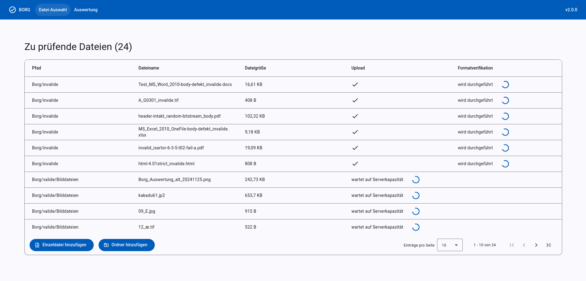
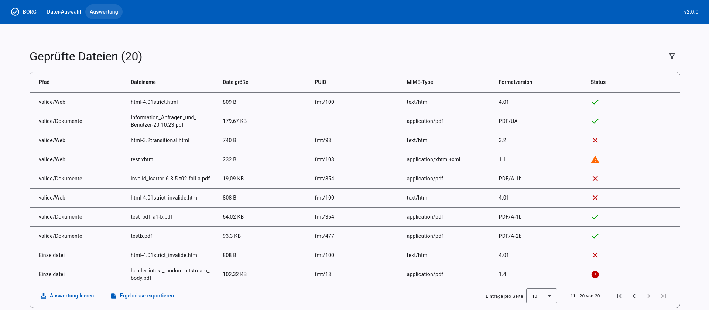
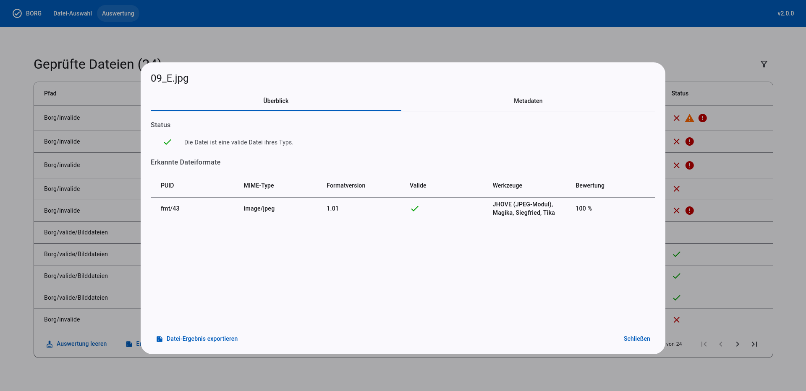
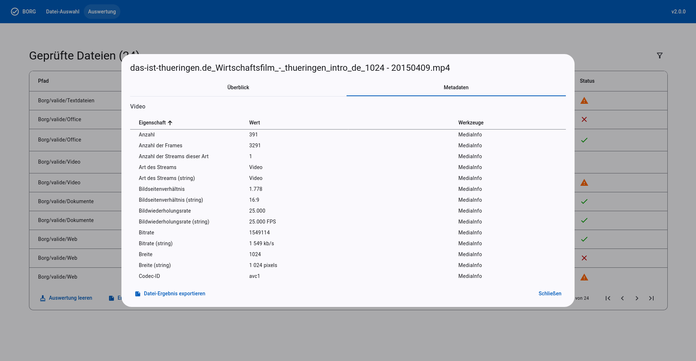
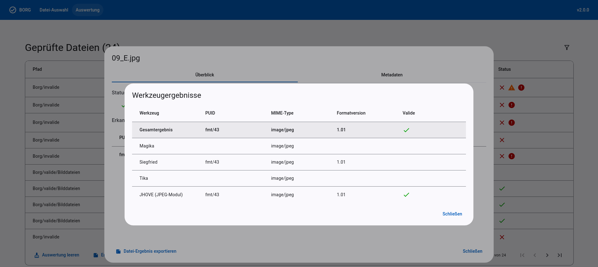
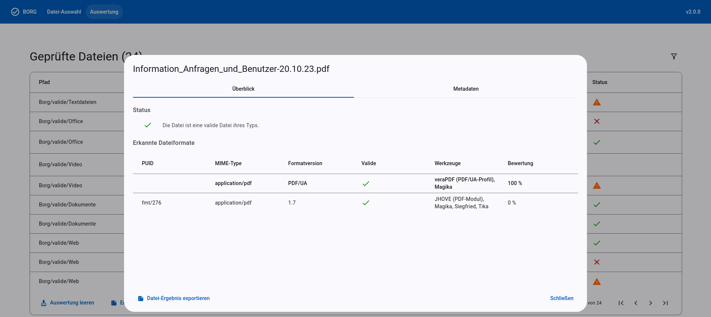
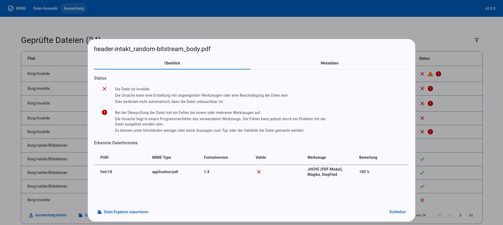

# Benutzerhandbuch

Borg stellt eine Standalone-Webanwendung bereit, mit der beliebige Dateien analysiert werden können.

## Datei-Auswahl

Der Reiter Dateiauswahl ermöglicht das Hinzufügen einzelner Dateien oder ganzer Ordner zur Analyse. Die Auswahl erfolgt entweder über einen Dateidialog oder per Drag-and-Drop. Beim Hochladen eines Ordners werden auch alle Dateien aus enthaltenen Unterordnern automatisch mit einbezogen.

<figure markdown="span">
  { loading=lazy }
   
  
<figcaption>Abb. 1: Datei-Auswahl</figcaption>

</figure>

## Auswertung

Im Reiter Auswertung wird das Gesamtergebnis aller hochgeladenen Dateien übersichtlich dargestellt. Jede Datei erscheint in einer eigenen Zeile mit den wichtigsten extrahierten Eigenschaften und einem Statussymbol, das die Qualität des Analyseergebnisses veranschaulicht. Durch Klicken auf eine Zeile wird die Detailansicht des jeweiligen Dateiergebnisses geöffnet.

<figure markdown="span">
  { loading=lazy }
   
  
<figcaption>Abb. 2: Auswertung für alle Dateiergebnisse</figcaption>

</figure>

## Detailansicht von Dateiergebnissen

Die Detailansicht eines Dateiergebnisses ist in zwei Reiter unterteilt.

Im ersten Reiter mit dem Titel _Überblick_ erhalten Sie eine allgemeine Zusammenfassung des Analyseergebnisses. Hier wird zunächst der Status der Analyse erläutert – beispielsweise, ob die Verarbeitung erfolgreich war, ob Warnungen aufgetreten sind oder ob es Fehler gab.

Darüber hinaus werden in diesem Reiter alle erkannten Dateiformate aufgelistet, die bei der Analyse der Datei identifiziert wurden.

<figure markdown="span">
  { loading=lazy }
   
  
<figcaption>Abb. 3: Detailansicht einer validen JPEG-Datei</figcaption>

</figure>

Im zweiten Reiter _Metadaten_ werden alle Eigenschaften angezeigt, die durch Borg während der Analyse aus der Datei extrahiert wurden. Die Informationen sind thematisch nach Kategorien gruppiert, um eine bessere Übersicht und schnellere Orientierung zu ermöglichen.

Der Fokus liegt hierbei vor allem auf technischen und inhaltlichen Metadaten. Dazu zählen beispielsweise Angaben zum Dateiformat, verwendete Codecs bei Audio- und Videodateien (wie z. B. Video-Codec, Auflösung oder Bildrate) sowie inhaltliche Informationen wie Titel, Autor, Erstellungsdatum oder andere eingebettete Metadaten.

<figure markdown="span">
  { loading=lazy }
   
  
<figcaption>Abb. 4: Metadatenansicht einer Videodatei</figcaption>

</figure>

Zu jedem erkannten Dateiformat kann eine Detailansicht geöffnet werden. Ein Klick auf eine Zeile in der Übersichtstabelle öffnet einen Dialog mit einer tabellarischen Darstellung der ermittelten Eigenschaften.

Dort ist ersichtlich, welche Werkzeuge welche Eigenschaften extrahiert haben und wie daraus das Gesamtergebnis gebildet wurde.

<figure markdown="span">
  { loading=lazy }
   
  
<figcaption>Abb. 5: Detailansicht für ein erkanntes Dateiformat</figcaption>

</figure>

Wenn bei der Analyse mehrere mögliche Dateiformate erkannt werden, unterstützt die Bewertung der Ergebnisse dabei, diese einzuordnen und die wahrscheinlichste Interpretation auszuwählen.

<figure markdown="span">
  { loading=lazy }
   
  
<figcaption>Abb. 6: Detailansicht einer Datei mit mehreren erkannten Dateiformaten</figcaption>

</figure>

Probleme mit einer Datei werden klar und deutlich in der Benutzeroberfläche angezeigt.

<figure markdown="span">
  { loading=lazy }
   
  
<figcaption>Abb. 7: Detailansicht einer fehlerhaften Datei</figcaption>

</figure>
